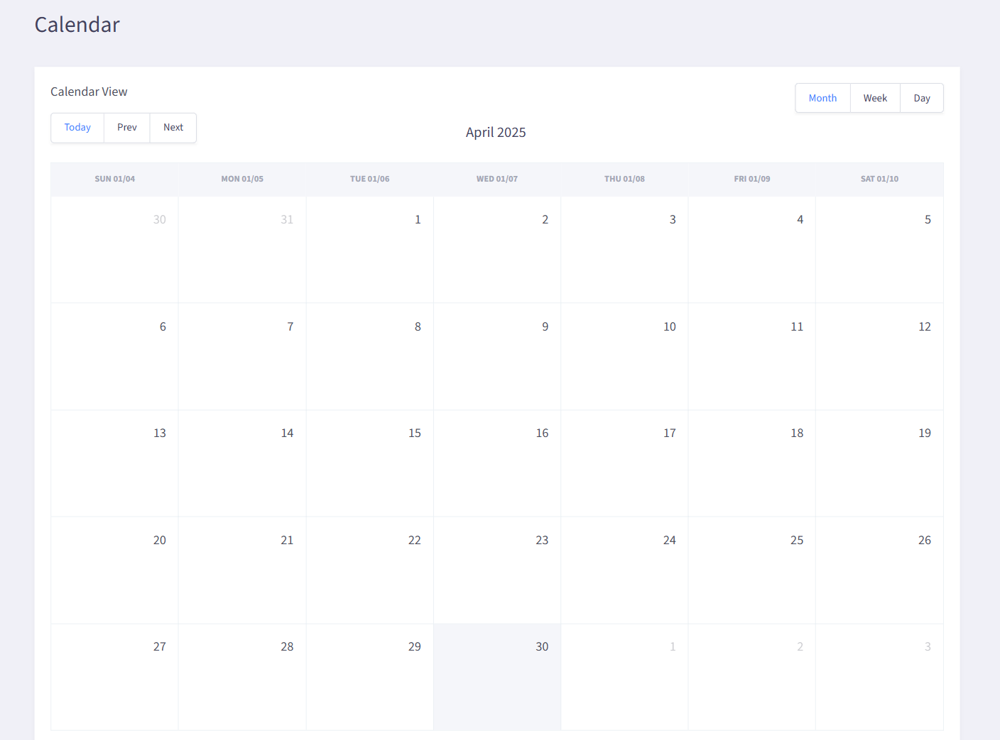

# Calendar App

[](https://vzhlznva.github.io/calendar-/)

---

## English

A modern calendar app built with Vue 3 + Vite, featuring drag & drop, custom event colors, adaptive UI, and GitHub Pages deployment.

**Live demo:** [https://vzhlznva.github.io/calendar-/](https://vzhlznva.github.io/calendar-/)

### Features

- Month/Week/Day calendar views
- Add, edit, and delete events
- Choose event color
- Drag & drop events on the calendar
- Date selection and highlight
- PWA support (installable)

### Tech stack

- **Vue 3** + Composition API
- **Vite** (fast build)
- **FullCalendar** (calendar UI)
- **TypeScript**
- **SCSS** (custom variables, theming)
- **PWA** (via VitePWA)

### Local development

```bash
npm install
npm run dev
```

### Build for production

```bash
npm run build
```

### Project structure

- `src/pages/index.vue` — main calendar component
- `src/styles/` — SCSS variables and styles
- `vite.config.ts` — build and deploy config

---

### Screenshot



## Українською

Сучасний календар на Vue 3 + Vite з підтримкою drag-n-drop, кастомними кольорами, адаптивним UI та деплоєм на GitHub Pages.

## Основний функціонал

- Відображення подій у вигляді календаря (місяць/тиждень/день)
- Додавання, редагування та видалення подій
- Вибір кольору події
- Drag-n-drop подій по календарю
- Вибір дати та підсвітка обраної дати
- PWA підтримка (можна додати на головний екран)

## Технології

- **Vue 3** + Composition API
- **Vite** (швидка збірка)
- **FullCalendar** (UI календаря)
- **TypeScript**
- **SCSS** (кастомні змінні, теми)
- **PWA** (через VitePWA)

## Запуск проекту локально

```bash
npm install
npm run dev
```

## Білд для продакшену

```bash
npm run build
```

## Структура проекту

- `src/pages/index.vue` — головний компонент календаря
- `src/styles/` — SCSS-змінні та стилі
- `vite.config.ts` — конфігурація білду та деплою

---

### Скриншот


